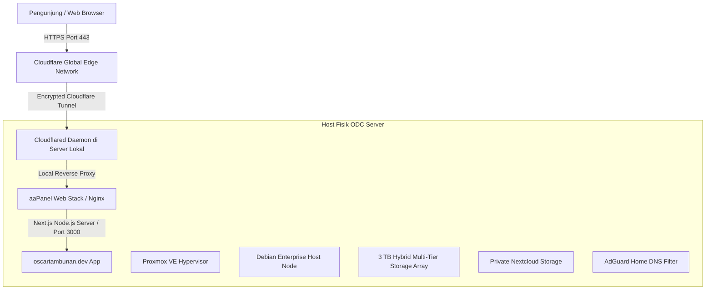

# Technical Architecture & System Specification: oscartambunan.dev

Dokumen spesifikasi teknis komprehensif ini disusun sebagai rujukan arsitektur, audit aset visual (PNG, JPG, WebP, SVG, PDF), struktur kode, serta infrastruktur *hosting* mandiri (*self-hosted*) untuk keperluan konsultasi teknis, audit kode, dan peninjauan oleh ahli rekayasa perangkat lunak.

---

## 1. Ikhtisar Sistem & Profil (Executive Summary)

- **Nama Proyek**: Portofolio Resmi & Showcase Teknis Oscar Tambunan
- **Domain Resmi**: `https://oscartambunan.dev`
- **Tujuan Sistem**: Menampilkan kapabilitas *Full-Stack Engineering*, administrasi sistem *Linux/Cloud*, infrastruktur *bare-metal virtualization*, manajemen aset/finansial, serta rekayasa perangkat lunak modern.
- **Pendekatan Arsitektur**: Modern Jamstack / Static Site Generation (SSG) dengan rendering dinamis parsial via Next.js App Router, berbasis TypeScript dan Tailwind CSS v4.

---

## 2. Rincian Teknologi (Technology Stack)

| Kategori | Teknologi | Versi | Catatan & Peran |
| :--- | :--- | :--- | :--- |
| **Framework Inti** | **Next.js (App Router)** | `16.2.10` | Bundler **Turbopack**, SSG, dynamic routing, image optimization, API routes |
| **Pustaka UI** | **React** | `19.2.4` | Server & Client Components, React DOM 19 |
| **Bahasa** | **TypeScript** | `5.x` | Strict type safety, interface-driven data models |
| **Styling & Theme** | **Tailwind CSS** | `4.x` | Engine CSS v4 berbasis `@theme inline`, variabel CSS kustom |
| **Tipografi** | **Plus Jakarta Sans** | Variable | Diinjeksi via `next/font/google` dengan weight 300–800 |
| **Animasi** | **Framer Motion** | `12.42.2` | Carousel 3D spring, lightbox transition, swipe gesture |
| **Ikonografi** | **Lucide React** | `1.25.0` | Ikon UI fungsional (navigasi, panah, dialog, external link) |
| **CDN Ikon Eksternal** | **Homarr Dashboard Icons** | jsDelivr | Ikon resmi teknologi (Proxmox, Nextcloud, Cloudflare, dll.) |
| **CDN Bendera** | **Flag Icons** | jsDelivr | Vektor resmi bendera Merah Putih Indonesia |

---

## 3. Audit & Pemetaan Format Aset Visual (PNG, JPG, WebP, SVG, PDF)

Website menerapkan strategi alokasi format media yang ketat untuk mencapai keseimbangan antara kualitas visual maksimal (*lossless crispness*), transparansi (*alpha channel*), dan performa kompresi jaringan (*throughput speed*).

### Ringkasan Distribusi Format File

```
public/
├── favicon.svg                          # [SVG]  Vector Favicon utama (resolusi tak terbatas)
├── icon/                                # [DIR]  Placeholder direktori ikon
├── images/
│   ├── icons/indonesia.svg              # [SVG]  Vektor bendera Indonesia
│   ├── logos/                           # [PNG]  Logo institusi dengan transparansi (Alpha channel)
│   ├── photography/                     # [JPG]  Foto pameran fotografi resolusi tinggi
│   ├── profile/                         # [JPG]  Foto potret profil & kontak
│   ├── projects/                        # [JPG]  Tangkapan layar proyek & mockup portal
│   └── wallpapers/                      # [WebP] Latar belakang high-resolution (Kompresi modern)
└── sertifikat/
    ├── *.pdf                            # [PDF]  Dokumen kredensial asli untuk verifikasi
    ├── *.png / *.jpg                    # [PNG/JPG] Sertifikat beresolusi tinggi (legitimasi)
    └── thumbnails/*.webp                # [WebP] Pratinjau ringan untuk carousel (fast-load)
```

---

### A. Format WebP (`.webp`) — *Modern High-Compression Graphics*
Digunakan khusus untuk grafis berdimensi besar seperti wallpaper latar belakang, hero banner, dan thumbnail sertifikat agar ukuran transfer hemat kuota (kompresi 30–70% lebih kecil dibanding JPEG konvensional).

| Path File | Ukuran File | Penggunaan / Komponen | Alasan Pemilihan Format |
| :--- | :--- | :--- | :--- |
| `/images/wallpapers/wallpaper-bendera-indonesia.webp` | ~137 KB | `HeroSection.tsx` (Background Ambient) | Format kompresi tinggi untuk visual lebar tanpa lag render. |
| `/images/wallpapers/wallpaper-section2.webp` | ~111 KB | `ContactSection.tsx` (Frosted Glass Card) | Menghadirkan tekstur grafis kaya detail dengan ukuran file efisien. |
| `/images/wallpapers/odc-hardware.webp` | ~45 KB | `AboutSection.tsx` (Drawer Hardware Host) | Wallpaper internal drawer kartu spesifikasi fisik ODC Server. |
| `/images/wallpapers/asset-management.webp` | ~31 KB | `AboutSection.tsx` (Drawer Asset Specs) | Wallpaper visual drawer alokasi treasury multi-aset. |
| `/images/wallpapers/cloudflare.webp` | ~134 KB | Cadangan Wallpaper Infrastruktur Cloudflare | Cadangan aset visual edge routing. |
| `/images/wallpapers/network.webp` | ~23 KB | Cadangan Wallpaper Jaringan FTTH | Cadangan aset visual topologi serat optik. |
| `/sertifikat/thumbnails/*.webp` (8 file) | 60–116 KB | `CertificationsSection.tsx` (Carousel 3D) | Pratinjau sertifikat sangat ringan agar animasi geser mulus (*60 FPS*). |

---

### B. Format PNG (`.png`) — *Lossless Alpha Transparency*
Digunakan khusus untuk logo institusi, lambang universitas, dan dokumen sertifikat yang membutuhkan tepian piksel tajam tanpa artefak kompresi serta latar belakang transparan.

| Path File | Ukuran File | Penggunaan / Komponen | Alasan Pemilihan Format |
| :--- | :--- | :--- | :--- |
| `/images/logos/odc.avif` | ~3 KB | `Footer.tsx` (Label Server) & Modal Sistem | Logo ODC transparan dalam format AVIF ultra-ringan. |
| `/images/logos/gunadarma.avif` | ~33 KB | `ExperienceSection.tsx` (Pendidikan) | Lambang resmi Universitas Gunadarma dalam format AVIF. |
| `/images/logos/labamen.avif` | ~21 KB | `ExperienceSection.tsx` (Asisten Lab) | Logo resmi Lab. Akuntansi Menengah Gunadarma dalam format AVIF. |
| `/images/logos/kspm.avif` | ~10 KB | `ExperienceSection.tsx` (Organisasi KSPM) | Logo Kelompok Studi Pasar Modal dalam format AVIF. |
| `/images/logos/kerjain.avif` | ~26 KB | Portfolio Project (Kerjain Platform) | Logo identitas software aplikasi dalam format AVIF. |
| `/images/logos/martha.avif` | ~12 KB | Subhalaman `/martha` & Portfolio | Identitas merchant ekosistem Martha dalam format AVIF. |
| `/sertifikat/IESE_Corporate Finance Essential.png` | ~461 KB | `CertificationsSection.tsx` | Salinan asli kredensial kursus IESE Business School. |
| `/sertifikat/PK_PKKMB.png` | ~1.25 MB | `CertificationsSection.tsx` | Sertifikat pengesahan kepanitiaan universitas beresolusi penuh. |

---

### C. Format JPG / JPEG (`.jpg`) — *Photographic & Scenery Assets*
Digunakan untuk foto bernuansa warna kontinu (fotografi jalanan, makro satwa liar, dan potret profil pribadi) di mana degradasi kompresi fotografis natural tidak mengganggu pandangan.

| Path File | Ukuran File | Penggunaan / Komponen | Alasan Pemilihan Format |
| :--- | :--- | :--- | :--- |
| `/images/profile/oscar-portrait.jpg` | ~64 KB | `HeroSection.tsx` (Kartu Foto Oscar) | Potret personal profesional berorientasi rasio 4:5. |
| `/images/profile/carmen-potrait.avif` | ~148 KB | `ContactSection.tsx` (Foto Profil Kontak) | Foto pendamping pada area kartu konsultasi & kontak dalam format AVIF modern. |
| `/images/photography/kota-tua-gambir.jpg` | ~77 KB | `GallerySection.tsx` (Street Photography) | Foto jalanan bernuansa historis arsitektur Jakarta. |
| `/images/photography/smoking-man.jpg` | ~113 KB | `GallerySection.tsx` (Human Interest) | Potret humaniora dengan kedalaman kontras hitam-putih/warna. |
| `/images/photography/ui-x-ug.jpg` | ~167 KB | `GallerySection.tsx` (Campus Architecture) | Dokumentasi arsitektur kampus kolaborasi UI & UG. |
| `/images/photography/capung.jpg` | ~45 KB | `GallerySection.tsx` (Nature Macro) | Fotografi makro capung dengan *shallow depth of field*. |
| `/images/photography/komodo.jpg` | ~249 KB | `GallerySection.tsx` (Wildlife Heritage) | Dokumentasi satwa endemik Taman Nasional Komodo. |
| `/images/projects/labamen-portal.jpg` | ~188 KB | `ProjectsSection.tsx` & Slug Proyek | Tangkapan layar web portal mahasiswa Lab. Akuntansi Menengah. |
| `/images/projects/labamen-admin.jpg` | ~116 KB | `ProjectsSection.tsx` & Slug Proyek | Tangkapan layar dashboard manajemen nilai praktikum. |
| `/images/projects/cloudflare-tunnel.jpg` | ~117 KB | `ProjectsSection.tsx` & Slug Proyek | Diagram & monitoring Cloudflare Zero Trust Tunnel. |
| `/images/projects/pesonatari.jpg` | ~216 KB | `ProjectsSection.tsx` & Slug Proyek | Pratinjau aplikasi sistem informasi kebudayaan tari tradisional. |
| `/images/projects/martha-merchant.jpg` | ~29 KB | `ProjectsSection.tsx` & `/martha` | Pratinjau antarmuka merchant ekosistem Martha. |

---

### D. Format SVG (`.svg`) — *Scalable Vector Graphics*
Digunakan untuk aset grafis geometris, ikon aplikasi, dan logo teknologi yang membutuhkan rendering instan tanpa rasterisasi pada rasio layar Retina apa pun.

- `/favicon.svg` (~299 bytes): Logo identitas tab browser.
- `/images/icons/indonesia.svg` (~178 bytes): Lambang bendera Merah Putih.
- CDN Homarr Dashboard Icons: 30+ ikon SVG resmi (Next.js, TypeScript, Tailwind, Docker, Proxmox, Cloudflare, Debian, Linux, aaPanel, MySQL, PHP, MariaDB, Postman, Figma, Python, Git, Nginx, Redis, dll.).

---

### E. Format PDF (`.pdf`) — *Official Verifiable Credentials*
Tersimpan di direktori `/public/sertifikat/` agar pengunjung dan rekruter dapat langsung mengunduh atau membuka dokumen sertifikasi asli dalam format standar industri:
- `Business Plan Gamification INFEST Competition 2026.pdf` (776 KB)
- `Databases and SQL for Data Science with Python.pdf` (329 KB)
- `Google Cloud Computing Foundation.pdf` (584 KB)
- `ICIKIWIR CORE TEAM.pdf` (775 KB)
- `Introduction to DevOps and Site Reliability Engineering (LFS162).pdf` (219 KB)

---

## 4. Struktur Direktori Proyek (Project Architecture)

```
oscartambunan.dev/
├── public/                      # Berkas statis publik yang disajikan langsung oleh Next.js
│   ├── favicon.svg
│   ├── images/
│   │   ├── icons/
│   │   ├── logos/
│   │   ├── photography/
│   │   ├── profile/
│   │   ├── projects/
│   │   └── wallpapers/
│   └── sertifikat/
│       ├── *.pdf, *.png, *.jpg
│       └── thumbnails/*.webp
├── src/
│   ├── app/                     # Next.js App Router (Halaman, Routing, Layout)
│   │   ├── api/
│   │   │   └── gallery/route.ts # Endpoint API internal untuk acak foto fotografi
│   │   ├── martha/page.tsx      # Showcase halaman produk Martha Merchant
│   │   ├── projects/[slug]/     # Halaman dinamis detail proyek (SSG via generateStaticParams)
│   │   │   └── page.tsx
│   │   ├── favicon.ico          # Fallback favicon browser jadul
│   │   ├── globals.css          # Design system Tailwind CSS v4 & custom tokens
│   │   ├── layout.tsx           # Root layout: font injection, JSON-LD Schema.org, SEO meta
│   │   ├── manifest.ts          # Web App Manifest PWA metadata
│   │   ├── page.tsx             # Halaman beranda utama (Single Page Application flow)
│   │   ├── robots.ts            # Konfigurasi robots.txt untuk Googlebot & crawler
│   │   └── sitemap.ts           # Dynamic XML sitemap generation
│   ├── components/              # Komponen modular antarmuka
│   │   ├── Footer.tsx           # Footer simetris: Server ODC + copyright + kebanggaan nasional
│   │   ├── MobileMenu.tsx       # Drawer navigasi mobile dengan backdrop blur & animasi spring
│   │   ├── Navbar.tsx           # Floating sticky navigation bar + language switcher
│   │   ├── sections/            # Modul bab / section halaman utama
│   │   │   ├── HeroSection.tsx           # Hero banner, status Proxmox VE, profile card
│   │   │   ├── AboutSection.tsx          # Spesifikasi ODC Server fisik & Alokasi Portofolio Aset
│   │   │   ├── SkillsSection.tsx         # Capabilities, tab kategori, ikon teknologi Homarr CDN
│   │   │   ├── ExperienceSection.tsx     # Riwayat pendidikan, lab assistant, organisasi KSPM
│   │   │   ├── ProjectsSection.tsx       # Karya terpilih, live link, pagination 4 item/halaman
│   │   │   ├── CertificationsSection.tsx # Carousel 3D sertifikat + zoom lightbox
│   │   │   ├── GallerySection.tsx        # Galeri fotografi + metadata EXIF modal
│   │   │   └── ContactSection.tsx        # Kartu kontak, frosted glass wallpaper, LinkedIn & IG
│   │   └── ui/                  # Komponen primitif atomik yang dapat digunakan kembali
│   │       ├── AnimatedSection.tsx       # Wrapper viewport scroll observer
│   │       ├── Button.tsx                # Tombol serbaguna berbagai varian (solid, outline, ghost)
│   │       ├── GlassCard.tsx             # Kartu efek kaca gelap dengan border tipis elegan
│   │       ├── LanguageToggle.tsx        # Tombol sakelar bahasa ID / EN
│   │       ├── ScrollIndicator.tsx       # Indikator panduan scroll ke bawah
│   │       ├── SectionHeading.tsx        # Standardisasi judul bab H2 & subtitle AGENTS.md
│   │       └── TechBadge.tsx             # Lencana tag teknologi
│   ├── context/
│   │   └── LanguageContext.tsx  # State bahasa global (Bilingual i18n Indonesia / English)
│   ├── data/                    # Single source of truth untuk seluruh data konten
│   │   ├── capabilities.ts      # Kategori keahlian & stack teknologi
│   │   ├── certifications.ts    # Data kredensial sertifikasi teknis
│   │   ├── education.ts         # Riwayat formal universitas
│   │   ├── experience.ts        # Riwayat pekerjaan & kepengurusan organisasi
│   │   ├── profile.ts           # Metadata profil, deskripsi biografi, tautan sosial
│   │   ├── projects.ts          # 9+ proyek unggulan lengkap dengan arsitektur & metrik
│   │   └── skills.ts            # Pemetaan keahlian teknis
│   ├── lib/
│   │   └── hooks/
│   │       └── useActiveSection.ts # IntersectionObserver hook untuk mendeteksi section aktif
│   └── types/
│       └── index.ts             # Definisi interface TypeScript (Project, Cert, Profile, dll.)
├── next.config.ts               # Konfigurasi Next.js
├── package.json                 # Manajemen dependensi npm
├── tsconfig.json                # Pengaturan compiler TypeScript
└── AGENTS.md                    # Pedoman hierarki tipografi & arsitektur proyek
```

---

## 5. Rincian Fitur & Fungsionalitas Tiap Bagian

### A. Navigasi & Bahasa (`Navbar.tsx` & `LanguageContext.tsx`)
- **Sticky Glass Header**: Mengambang di bagian atas dengan efek `backdrop-blur-md` dan background semitransparan `rgba(8,10,16,0.85)`.
- **Active Section Spy**: Menu secara otomatis menyala (*active glow*) mengikuti posisi scroll pengguna menggunakan hook `useActiveSection`.
- **Sistem Bilingual Ringan (i18n)**: Sakelar bahasa **ID (Indonesia)** dan **EN (English)** berjalan instan di sisi klien tanpa *re-fetch* atau *page-reload*, tersimpan di `localStorage`.

### B. Hero Section (`HeroSection.tsx`)
- **Lencana Status Node Proxmox**: Indikator operasional hijau berkedip `🟢 Proxmox VE · Host Node 01` yang merepresentasikan kesiapan server fisik ODC.
- **Kartu Profil & Status Kerja**: Menampilkan foto potret personal Oscar Tambunan, badge ketersediaan *Open for Roles*, dan teks pengenalan peran *Junior Full-Stack Developer*.
- **Quick Jump Anchors**: Tombol cepat menuju bab *Selected Works* dan *Get in Touch*.

### C. Infrastruktur ODC & Manajemen Aset (`AboutSection.tsx`)
- **Drawer Interaktif Spesifikasi Teknis**:
  - Menyajikan dua kartu utama: **Hardware & Systems Infrastructure** dan **Asset Management**.
  - Saat kartu diklik, modal geser (*sheet/drawer*) menampilkan rincian mendalam seperti alokasi core CPU, RAM DDR4, kapasitas 3TB hybrid array, efisiensi daya 35W TDP, konfigurasi *Proxmox VE*, jaringan FTTH 150 Mbps, dan arsitektur *Cloudflare Zero Trust Tunnel*.
  - Menampilkan alokasi treasury multi-aset (Danamas 46.6%, Deposito 20.3%, Saham 18.6%, Valas 14.5%) dengan tata kelola risiko terukur.

### D. Keahlian & Stack Teknologi (`SkillsSection.tsx`)
- **Tab Kategori Terstruktur**: Frontend, Backend & Database, Cloud & Infrastructure, Tools & Automation.
- **Ikon Asli Resolusi Tinggi**: Terhubung dengan CDN *Homarr Dashboard Icons* untuk menampilkan logo asli setiap teknologi dengan akurasi warna resmi.

### E. Pendidikan & Pengalaman (`ExperienceSection.tsx`)
- **Kepatuhan Hierarki Tipografi (AGENTS.md)**:
  - Level 1: `<SectionHeading />` standar universal.
  - Level 2 (`<h3>`): Nama institusi seragam (`Universitas Gunadarma`, `Lab. Akuntansi Menengah`, `Kelompok Studi Pasar Modal (KSPM)`).
  - Level 3 (`<h4>`): Jabatan/Peran (`IT Staff & Support`, `Head of Asset Management`, `Undergraduate Degree`).
  - Level 4: Metadata garis waktu (`2024 — Sekarang · Depok · On-site`).
  - Level 5: Poin-poin pencapaian dengan spasi konsisten dan keterbacaan tinggi.

### F. Karya Terpilih (`ProjectsSection.tsx` & `src/app/projects/[slug]`)
- **Pagination Cerdas**: Menampilkan 4 proyek per halaman dengan navigasi nomor halaman yang mulus.
- **Visual Thumbnail Unik**: Setiap proyek memiliki thumbnail custom (logo dinamis Nextcloud, Proxmox VE, atau tangkapan layar sistem asli).
- **Halaman Detail Statis (SSG)**: Menggunakan `generateStaticParams()` Next.js untuk merender halaman slug proyek secara instan tanpa pemuatan lambat.

### G. Sertifikasi & Kredensial Teknis (`CertificationsSection.tsx`)
- **Carousel 3D Spring-Physics**:
  - Kartu tengah (*active*) tampil fokus, kartu kiri dan kanan mengintip secara elegan.
  - Mendukung navigasi tombol panah kiri/kanan keyboard, tombol navigasi desktop, dan *touch swipe* pada layar sentuh smartphone.
- **Lightbox Zoom Penuh**: Pengunjung dapat memperbesar dokumen untuk membaca detail sertifikat beresolusi tinggi.
- **Tautan Verifikasi Asli**: Tombol **BUKA DOKUMEN** mengarah langsung ke berkas PDF atau tautan akreditasi resmi.

### H. Galeri Fotografi (`GallerySection.tsx` & `/api/gallery`)
- **Dynamic API Shuffle**: Membaca folder `/public/images/photography` di server, mengutamakan foto unggulan (*Kota Tua Gambir*), dan mengacak urutan foto lainnya pada setiap sesi.
- **Modal Lightbox EXIF**: Dilengkapi informasi kamera, kecepatan rana, ISO, dan deskripsi cerita di balik foto.

### I. Kontak & Footer (`ContactSection.tsx` & `Footer.tsx`)
- **Frosted Glass Contact Card**: Dilapisi wallpaper visual berpadu efek kaca gelap (`bg-[#070c18]/80 backdrop-blur-md`).
- **Akses Komunikasi Resmi**: Menyediakan tautan email langsung, akun profesional LinkedIn, serta akun Instagram resmi `@oss_tam`.
- **Footer Simetris & Bersih**: Logo ODC + tulisan **Server**, hak cipta, serta lambang bendera Merah Putih dengan moto *"Saya Indonesia dan Saya Bangga"*.

---

## 6. Infrastruktur Server & Hosting Mandiri (Self-Hosted ODC Environment)

Website ini bukan sekadar web statis yang di-hosting di server publik gratisan, melainkan disajikan langsung dari infrastruktur server fisik milik Oscar Tambunan:



### Spesifikasi Fisik & Jaringan Host:
1. **Perangkat Keras**: Dedicated 8 Cores CPU, 16 GB DDR4 RAM, efisiensi tinggi 35W TDP (beroperasi 24 jam non-stop).
2. **Virtualisasi**: *Proxmox VE Type-1 Bare-Metal Hypervisor* dengan kontainer LXC dan KVM Virtual Machines terisolasi.
3. **Konektivitas Internet**: Jaringan serat optik FTTH kecepatan tinggi 150 Mbps dengan proteksi CGNAT.
4. **Keamanan Tanpa Port Publik (Zero Inbound Open Ports)**: Menggunakan teknologi **Cloudflare Encrypted Tunnel** (`cloudflared`). Tidak ada port router yang dibuka (*no port forwarding*), sehingga server fisik kebal dari pemindaian bot jaringan luar (*port scan immunity*).
5. **DNS & Enkripsi**: Dikelola penuh dengan proteksi SSL/TLS otomatis di edge Cloudflare dan DNS penyaring AdGuard Home lokal.

---

## 7. Rekomendasi Teknis untuk Diskusi Bersama Ahli (Consultant Review Checklist)

Poin-poin berikut sangat disarankan untuk diajukan kepada konsultan atau ahli teknis saat sesi konsultasi:

1. **Pipeline Kompresi Gambar Otomatis**:
   - *Status saat ini*: Wallpaper dan thumbnail sertifikat sudah berformat `.webp`, logo transparan berformat `.png`, dan karya fotografi berformat `.jpg`.
   - *Poin konsultasi*: Apakah disarankan mengimplementasikan *build-time image conversion* (misalnya menggunakan pustaka `sharp`) untuk mengubah seluruh foto `.jpg` portofolio menjadi `.webp` atau `.avif` otomatis saat proses build?
2. **Caching Headers & Cloudflare CDN Rule**:
   - *Poin konsultasi*: Konfigurasi header `Cache-Control: public, max-age=31536000, immutable` untuk direktori `/_next/static/` dan `/images/` pada level edge Nginx / Cloudflare.
3. **Monitoring & Healthcheck Daemon**:
   - *Poin konsultasi*: Implementasi Prometheus / Grafana node exporter pada Proxmox VE untuk mengirim status latensi dan utilisasi RAM server langsung ke webhook portofolio.
4. **Keamanan Content Security Policy (CSP)**:
   - *Poin konsultasi*: Penyempurnaan CSP headers di `next.config.ts` untuk membatasi eksekusi skrip hanya dari domain terpercaya (jsDelivr, Schema.org, Cloudflare).

---
*Dokumen ini diperbarui secara otomatis dan merefleksikan kode sumber aktif per branch `main` pada repositori oscartambunan.dev.*
